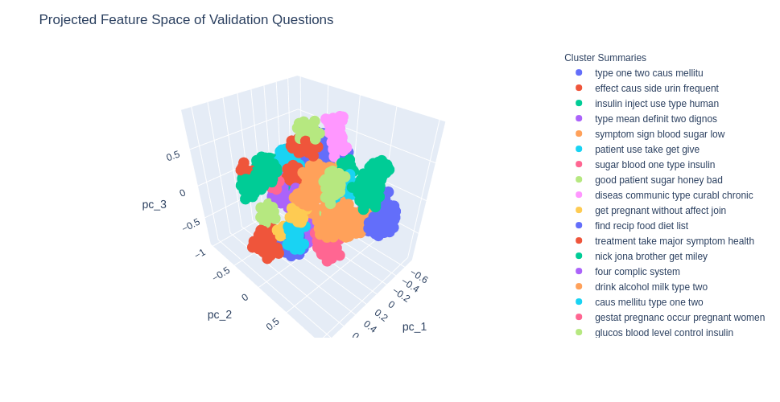

# sentence-2-vec
Learning sentence representations from domain-specific QA pairs scraped from
the web.

|  |
| :-: |
| *Some clusters discovered from "Diabetes" topic questions on answers.com.* |

### Environment:

- Python 3.8.5

### Install Python Packages:

```
$ pip install -r requirements.txt
```

### QA Pairs Text Dataset Format:

This project assumes you have a dataset of question-answer pairs pre
-configured locally on your machine and saved as a `csv` file. My
[dataset-helpers](https://github.com/dylanell/dataset-helpers) Github project
also contains tools that perform this local configuration automatically for
data scraped from [answers.com](https://www.answers.com/). The `csv` file
should be in the following format:

```
question, answer
question one ?, answer one .
question two ?, answer two .
...
```

The dataset processing in this project assumes the text data in each row of
the `csv` datafile is ready to be tokenized by whitespace alone. For example,
row one of the example `csv` file above would yield a tokenized question
example as `['question', 'one', '?']`. It is important to note that if the
question of row one was `question one?`, the tokenization in this project would
yield `['question', 'one?']`, therefore punctuation must be pre-processed as
separate words and separated by a 'space' character prior to generating the
`csv` datafile for this project.

 ### Training:

Training options and hyperparameters are pulled from the `config.yaml` file and
can be changed by editing the file contents. The `train.py` script accepts only
several specific values for the `model_type` variable in `config.yaml`
corresponding to the type of NLP model you would like to train. Train a model
by running the command:

```
$ python train.py
```

### Jupyter Notebook:

This project is accompanied by a Jupyter notebook that explores the learned
sentence representations by performing data visualizations and cluster
analysis. If Github fails to render the notebook itself, you can also view it
by pasting the [notebook URL](https://github.com/dylanell/sentence-2-vec/blob/main/notebook.ipynb) into https://nbviewer.jupyter.org/. Use the following
command to start the Jupyter notebook server in your browser:

```
$ jupyter-notebook notebook.ipynb
```

### Serving a Trained Model:

This project also includes a Python script to deploy a trained model serving API for inference on user queries. Model serving is performed by computing the sentence vector for a user input query and assigning this vector to its closest representative cluster vector from clusters computed running the Jupyter notebook above. Therefore, you must first run the notebook above to explore satisfactory clustering results for your trained model, which produces a `clusters.csv` file containing representative vectors and top-5 word summaries for each discovered cluster. The model serving script pulls variables from the same configuration file as the training script, therefore it will search for a trained model file corresponding to `model_name` located within the `output_directory`. Serve a trained model by running the command:

```
$ python serve.py
```

The above script will provide a local API endpoint in which novel queries can be sent to be categorized using the following request structure:

```
TODO: finish API endpoint
```

### References:

1. [A Comprehensive Introduction to Torchtext](https://mlexplained.com/2018/02/08/a-comprehensive-tutorial-to-torchtext/)
2. [Load Datasets With Torchtext](https://dzlab.github.io/dltips/en/pytorch/torchtext-datasets/)
3. [CNN for Text](https://arxiv.org/pdf/1408.5882.pdf)
4. [Dynamic CNN (DCNN) for Text](https://arxiv.org/pdf/1404.2188.pdf)
5. [Attention is All You Need](https://arxiv.org/pdf/1706.03762.pdf)
6. https://medium.com/@nainaakash012/simclr-contrastive-learning-of-visual-representations-52ecf1ac11fa
7. http://yann.lecun.com/exdb/publis/pdf/hadsell-chopra-lecun-06.pdf
8. https://arxiv.org/pdf/2010.05113.pdf
9. https://gombru.github.io/2019/04/03/ranking_loss/
10. [On the Surprising Behavior of Distance Metrics in High Dimensional Space](https://bib.dbvis.de/uploadedFiles/155.pdf)
11. [When is Nearest Neighbor Meaningful?](https://members.loria.fr/MOBerger/Enseignement/Master2/Exposes/beyer.pdf)
12. [FaceNet: A Unified Embedding for Face Recognition and Clustering](https://arxiv.org/pdf/1503.03832.pdf)
13. [Deep Metric Learning Using Triplet Network](https://arxiv.org/pdf/1412.6622.pdf)
14. [Learning Thematic Similarity Metric Using Triplet Networks](https://pdfs.semanticscholar.org/0846/f3cb0ae555c4f7015dca2fce6a047501154f.pdf?_ga=2.178325220.1389316910.1606965483-939693653.1606965483)
15. [Siamese Recurrent Architectures for Learning Sentence Similarity](https://www.researchgate.net/publication/307558687_Siamese_Recurrent_Architectures_for_Learning_Sentence_Similarity)
16. [Fractional norms and quasinorms do not help to overcome the curse of dimensionality](https://arxiv.org/pdf/2004.14230.pdf)
17. [Hyperbolic Representation Learning for Fast and Efficient Neural Question Answering](https://arxiv.org/pdf/1707.07847.pdf)
18. [Embedding Text in Hyperbolic Spaces](https://arxiv.org/pdf/1806.04313.pdf)
19. [Skip-Thought Vectors](https://arxiv.org/pdf/1506.06726.pdf)
20. [How to use Pre-trained Word Embeddings in PyTorch](https://medium.com/@martinpella/how-to-use-pre-trained-word-embeddings-in-pytorch-71ca59249f76)
